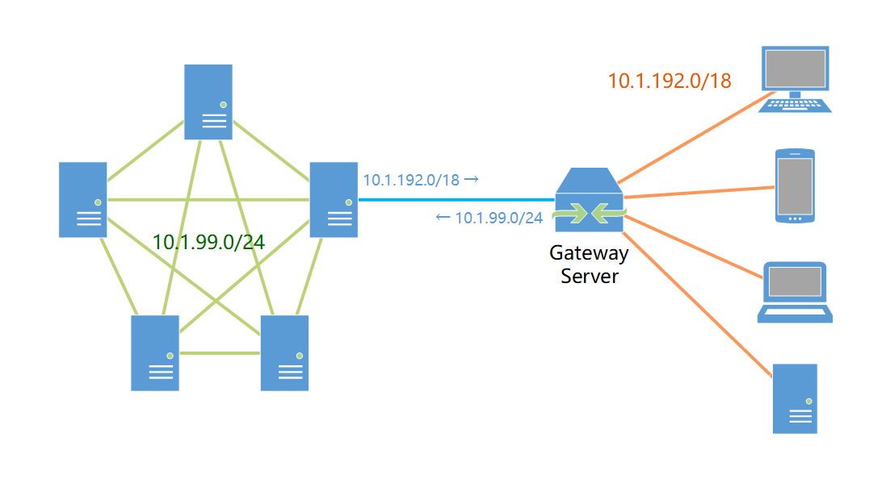

## Motivation

A machine learning cluster needs a secure way to expose services to users, as well as to interconnect servers across the public network. For this, a VPN network needs to be deployed.

Deploying a VPN network requires considering the following factors:

1. Network topology: an appropriate topology must be chosen to minimize latency as much as possible;
2. User management: it should be easy to add or remove users and to authorize them;
3. Simplicity of use and maintenance.

## Design

### Network Topology

The network topology determines the latency.

The lowest-latency option is obviously full-mesh, i.e. every pair of peers has a direct P2P connection. However, the management complexity of this topology is $\mathcal{O}(n^2)$, and adding a new peer requires modifying the configuration files of all other peers. It also has to deal with the problems introduced by NAT, which requires some automated management software. I tried [Netmaker](https://www.netmaker.io/) and [Headscale](https://headscale.net/), but neither of them seemed able to correctly handle the **complex network environment** within the campus, such as the symmetric NAT used by various enterprise-grade routers, and **the probability of successfully establishing P2P was very low**.

In the end I chose a **topology that combines full-mesh and hub-and-spoke**. Since the number of servers and their IPs rarely change, manually configuring a full-mesh network among the servers is feasible. At the same time, a gateway server is provided as the hub for user access, and users only need to establish a connection with the gateway server. Since most users actually use the VPN within the campus, connecting to the on-campus gateway server and forwarding traffic through it does not introduce much additional latency. This structure balances latency and management complexity, and adding/removing and authorizing users only needs to be done on the gateway server.



### Protocol Choice

The popular OpenVPN and IPSec are both good enough, but the emerging WireGuard offers unparalleled configuration simplicity. On the server side, WireGuard can define a peer and a route with just a few lines of configuration; on the user side, since WireGuard uses key-pair-based authentication, a single configuration file is enough to join the VPN network, with no need to remember an additional password or perform a login operation.

### Management Approach

For the sake of predictability and stability, I chose the manual configuration approach. The full-mesh network among servers does not need to be changed frequently once it is configured. User management, on the other hand, is implemented through a script: when a new user needs to be added, the script generates a key pair and allocates an IP, adds the public key and routing information to the gateway server's peer list, then generates a configuration file containing the private key and the allocated IP, and sends it to the user.

Example of a user peer configuration on the gateway server:

```ini
[Peer]
PublicKey = <redacted>
AllowedIPs = 10.1.x.y/32
AllowedIPs = fd01::x:y/128
PersistentKeepalive = 25
```

Example of a user's access configuration file:

```ini
[Interface]
PrivateKey = <redacted>
Address = 10.1.x.y/16
Address = fd01::x:y/64

[Peer]
PublicKey = <redacted>
AllowedIPs = 10.1.0.0/16  # route all VPN traffic to gateway server
AllowedIPs = fd01::/64
Endpoint = wg.ustcaigroup.xyz:51820  # gateway server is dual stack
# Endpoint = wg.ustcaigroup.xyz:51820  # IPv4
# Endpoint = wg.ustcaigroup.xyz:51820  # IPv6
PersistentKeepalive = 25
```
