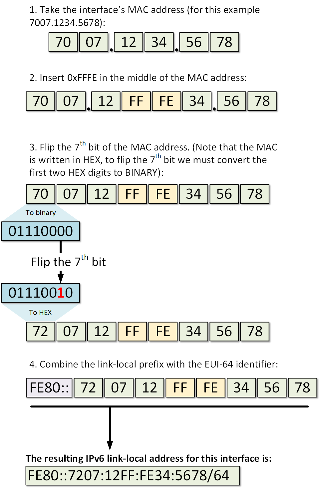
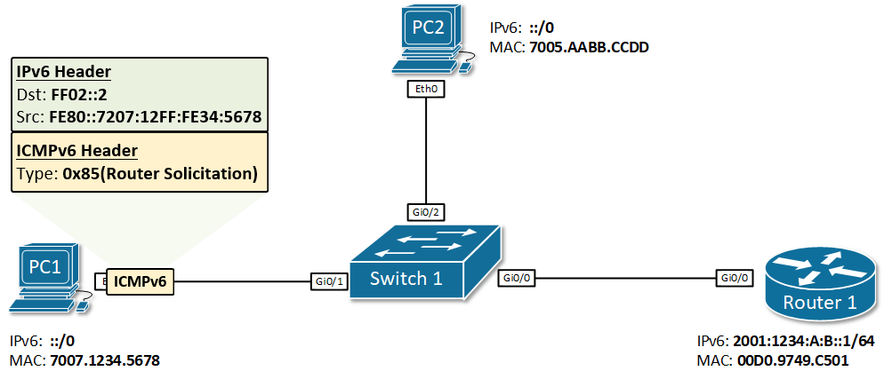

## Preface

IPv4 has only one method of dynamic address allocation, namely DHCP, but IPv6 has two allocation methods, SLAAC and DHCPv6, and DHCPv6 additionally has the PD (Prefix Delegation) extension. These three allocation methods also interact with each other, which makes problems arising during IPv6 allocation far more common than with IPv4. Most tutorials you can find only solve problems superficially, are ambiguous about the underlying technical details, and do not fundamentally clarify the differences between IPv6 and IPv4.

This article aims to start from the relevant fundamental concepts and, in a "teach a man to fish" manner, explain how the three IPv6 address allocation methods work, helping to thoroughly resolve the tricky problems in IPv6 allocation.

## IPv6 Fundamental Concepts

### LLA (Link-Local Address) and EUI-64

LLA actually already existed in IPv4: when DHCP is not working properly, some operating systems assign a `169.254.0.0/16` address to the network interface for temporary point-to-point communication. But LLA is not important in IPv4, playing only an optional fallback role that appears only when DHCP fails. As a result, the vast majority of people (including the author) did not learn about the existence of LLA until IPv6 became widespread.

IPv6 LLA (`fe80::/8`) inherits the basic point-to-point communication function of IPv4 LLA, but goes further to take on the important functions of NDP (Neighbor Discovery Protocol) and SLAAC (Stateless Address Autoconfiguration). Understanding it is necessary to understand how SLAAC works.

For example, when two network ports are directly connected with a cable, they each automatically generate an IPv6 LLA, such as `fe80::dfc2:d2aa:c86f:171e/64` and `fe80::da8f:9d5b:57e3:c6a6/64`, and each can `ping` the other's LLA. On Linux, the `ip -6 route` command shows the automatically configured LLA route entry:

```txt
fe80::/64 dev eth0 proto kernel metric 1024 pref medium
```

IPv6 LLA is generated from the MAC address using a specific algorithm, namely EUI-64. For example, when the network port's MAC address is `70:07:12:34:56:78`, the generated EUI-64 is `7207:12ff:fe34:5678`, and the LLA is `fe80:7207:12ff:fe34:5678/64` (EUI-64 with the `fe80` prefix prepended). The specific generation process is shown in the figure below:



Generally, routers do not forward traffic for LLA addresses; it is **only used for point-to-point communication on the link**.

### GUA (Global Unicast Address)

IPv6 GUA (`2000::/3`) can be mapped to the IPv4 concept of a "public IP". In theory it is globally unique and can be used for communication over the public network. A well-designed network architecture should allow every device to obtain an IPv6 GUA, so as to maximize IPv6's P2P communication advantage.

### Private Addresses

`fc00::/7` is defined as the IPv6 private address range, analogous to `10.0.0.0/8`, `172.16.0.0/12`, and `192.168.0.0/16` in IPv4, used for LAN communication. Unlike LLA, it can be forwarded by routers.

Because IPv6 is designed so that every device worldwide can be assigned a GUA, the role of private addresses in IPv6 is greatly diminished. When it is not possible to assign a GUA to every device (as in some campus network environments), assigning IPv6 private addresses on the internal network can serve as an alternative, allowing internal devices to access IPv6.

### Multicast

IPv6 multicast addresses (`ff00::/8`) are similar to IPv4 multicast addresses (`224.0.0.0/4`), used for one-to-many communication within a network segment. **Both SLAAC and DHCPv6 rely on multicast to work**. Commonly used multicast addresses include:

- `ff02::1`: all nodes on the local link;
- `ff02::2`: all routers on the local link.

### NDP (Neighbor Discovery Protocol)

NDP works on top of ICMPv6 and is similar to IPv4 ARP. It is used to discover other nodes on the data link layer and their corresponding IPv6 addresses, to determine available routes, and to maintain reachability information about available paths and other active nodes. **SLAAC works based on NDP**. The message types involved are:

1. RS (Router Solicitation) and RA (Router Advertisement): used to configure IPv6 addresses and routes;
2. NS (Neighbor Solicitation) and NA (Neighbor Advertisement): used to find the MAC addresses of other devices on the link.

## SLAAC (Stateless Address Autoconfiguration)

SLAAC is the IPv6 address allocation method defined in [RFC 4862](https://datatracker.ietf.org/doc/html/rfc4862), and is also the **recommended allocation method**. In fact, Android only supports SLAAC for IPv6 allocation.

The most notable feature of SLAAC is that it is stateless, i.e. it does not require a centralized server responsible for allocation. Below, the author uses an example to illustrate the SLAAC process.

Suppose the `lan0` port on the **router** is connected to the `eth0` port on the **host**. The LLA of `lan0` is `fe80::1/64`, and the MAC address of `eth0` is `70:07:12:34:56:78`. At the same time, the router holds the GUA prefix `2001:db8::/64`, i.e. all GUAs under this subnet will be routed by the upstream router to this router's `wan` port. The SLAAC process is as follows:

1. `eth0` generates the EUI-64 `7207:12ff:fe34:5678` and the LLA `fe80:7207:12ff:fe34:5678/64` based on its MAC address;
2. The host performs DAD (Duplicated Address Detection) to ensure the LLA is unique on the local link. This is unrelated to address allocation, so it is omitted here; interested readers can look up the relevant material themselves;
3. The host sends an RS message via the `eth0` LLA. The RS is sent to all routers on the local link using the multicast address `ff02::2`.
4. The router replies with an RA message to the `eth0` LLA. The RA contains the prefix `2001:db8::/64`, the validity period, the MTU, and other information.
5. The host receives the RA, combines the prefix and the EUI-64 into `2001:db8::7207:12ff:fe34:5678/64`, assigns it to `eth0`, and adds the routing table entries:

   ```txt
   2001:db8::/64 dev eth0 proto ra metric 1024 expires 2591993sec pref medium
   default via fe80::1 dev eth0 proto static metric 1024 onlink pref medium
   ```

6. The host performs DAD detection and uses an NA message to announce the use of the new address to neighbors on the link.



SLAAC looks great, but it has an **important flaw**: it does not support distributing DNS information, so the host must obtain DNS through some other means (usually DHCPv6). There are two flag bits in the RA to address this problem:

- `M` (Managed Address Configuration): address information can be obtained via DHCPv6;
- `O` (Other Configuration): other information (such as DNS) can be obtained via DHCPv6.

The newer [RFC 6106](https://datatracker.ietf.org/doc/html/rfc8106) supports distributing DNS information by adding RDNSS (Recursive DNS Server) and DNSSL (DNS Search List) to the RA. For the level of RDNSS support across operating systems, see [Comparison of IPv6 support in operating systems](https://en.wikipedia.org/wiki/Comparison_of_IPv6_support_in_operating_systems). In practice, in the vast majority of cases you only need to configure IPv4 DNS (obtained via DHCPv4), so the RDNSS extension is not very meaningful.

The problem with the EUI-64-based SLAAC address configuration above is that **the addresses it generates are fixed and predictable**, which brings security and privacy concerns. The IPv6 SLAAC privacy extension defined in [RFC 4941](https://datatracker.ietf.org/doc/html/rfc4941) solves this problem. During SLAAC it also generates random, periodically rotated addresses to address the privacy issue. At the same time, the EUI-64-generated address is also retained, for use by externally incoming connections. With the privacy extension enabled, the IPv6 addresses generated on Linux look like the following, for example (from top to bottom: the privacy address, the EUI-64 GUA, and the LLA):

```txt
2: eth0: <BROADCAST,MULTICAST,UP,LOWER_UP> mtu 1500 qdisc cake state UP group default qlen 1000
    link/ether 70:07:12:34:56:78 brd ff:ff:ff:ff:ff:ff
    inet6 2001:db8::dead:beef:aaaa:bbbb/64 scope global temporary dynamic
       valid_lft 2591998sec preferred_lft 604798sec
    inet6 2001:db8::7207:12ff:fe34:5678/64 scope global dynamic mngtmpaddr noprefixroute
       valid_lft 2591998sec preferred_lft 604798sec
    inet6 fe80:7207:12ff:fe34:5678/64 scope link
       valid_lft forever preferred_lft forever
```

## DHCPv6

DHCPv6 operates in broadly the same way as DHCPv4: the host sends a multicast message to `ff02::1:2` on UDP port 547, and the DHCPv6 server replies with address, DNS, and other information.

The difference is that DHCPv6 can run in either a stateful or a stateless mode, the distinction being whether or not an address is obtained. When used together with SLAAC, the host only needs to obtain DNS and other information from DHCPv6, so stateless DHCPv6 can be used.

## DHCPv6 PD (Prefix Delegation)

PD is a DHCPv6 extension defined in [RFC 3633](https://datatracker.ietf.org/doc/html/rfc3633). It is used to distribute IPv6 prefixes across a network.

With the PD extension enabled, the DHCP server grants the host the right to use an IPv6 subnet prefix (such as `2001:db8::/56`) and adds routing table entries to ensure that all addresses under this subnet are routed to the host that requested the prefix. The host can then further subdivide and allocate this subnet.

A typical use case for DHCPv6 PD is home ISP network access. The home gateway router requests an IPv6 prefix from the ISP DHCP server, and then distributes addresses from this subnet prefix within the home internal network via SLAAC.

## Conclusion

This article briefly introduced some of the concepts involved in IPv6 address allocation and explained how SLAAC, DHCPv6, and DHCPv6 PD work. In terms of simplifying address management, IPv6 can be said to have been rather unsuccessful: multiple standards coexist, and there are various combinations of them, which gives clients a non-trivial probability of failing to correctly obtain IPv6.

In practice, the three most common IPv6 allocation scenarios we encounter are:

- Pure SLAAC: typical campus networks (education networks) fall into this category. In practice, the author has found cases where a misconfigured host on the internal network indiscriminately sends RAs, causing the IPv6 of all hosts on the entire internal network to be misconfigured. At the same time, in this mode, a router you connect yourself will no longer be able to distribute SLAAC GUAs to downstream devices, because the local-link multicast packets that SLAAC relies on cannot be forwarded by the router (this can be solved via IPv6 bridging or NAT6, which is not elaborated on here).
- Pure DHCPv6: some enterprise internal networks use this mode, because DHCPv6 allows centralized management. The biggest problem with this mode is that [Android does not support DHCPv6](https://www.nullzero.co.uk/android-does-not-support-dhcpv6-and-google-wont-fix-that/). But under other operating systems, this mode runs fairly stably.
- SLAAC + DHCPv6 PD: this is the most common mode for home ISP network access. Most home routers are adapted for it and work out of the box.

## References

- [IPv6 Stateless Address Auto-configuration (SLAAC)](https://www.networkacademy.io/ccna/ipv6/stateless-address-autoconfiguration-slaac)
- [RFC 4862: IPv6 Stateless Address Autoconfiguration](https://datatracker.ietf.org/doc/html/rfc4862)
- [RFC 6106: IPv6 Router Advertisement Options for DNS Configuration](https://datatracker.ietf.org/doc/html/rfc8106)
- [RFC 4914: Privacy Extensions for Stateless Address Autoconfiguration in IPv6](https://datatracker.ietf.org/doc/html/rfc4941)
- [RFC 3633: IPv6 Prefix Options for Dynamic Host Configuration Protocol (DHCP) version 6](https://datatracker.ietf.org/doc/html/rfc3633)
- [Android does not support DHCPv6 and Google 'Won't Fix' that](https://www.nullzero.co.uk/android-does-not-support-dhcpv6-and-google-wont-fix-that/)
- [Comparison of IPv6 support in operating systems](https://en.wikipedia.org/wiki/Comparison_of_IPv6_support_in_operating_systems)
